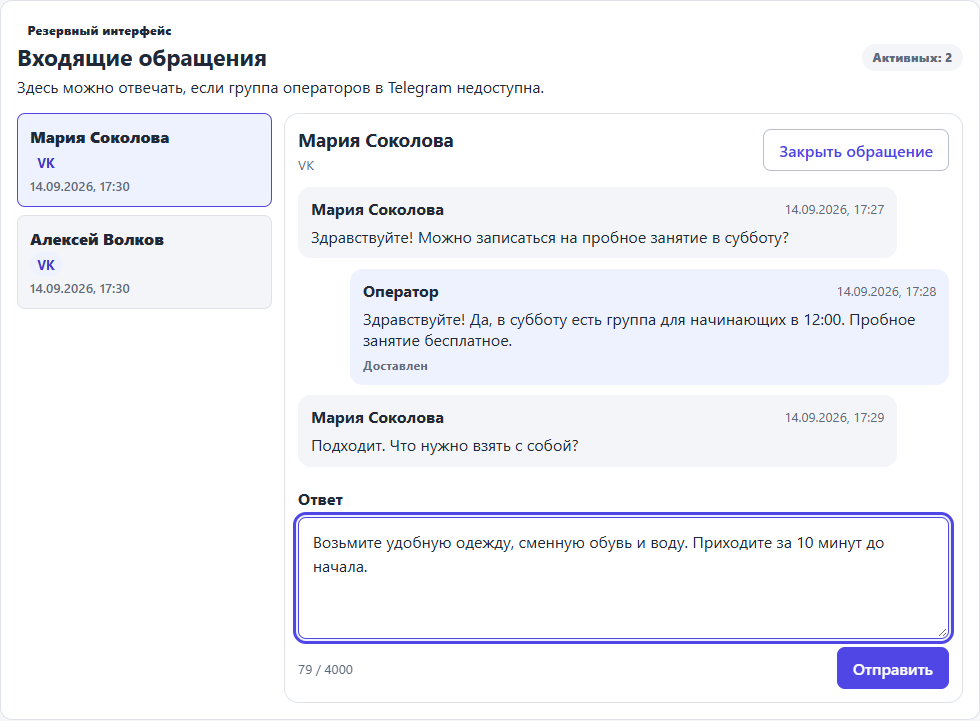
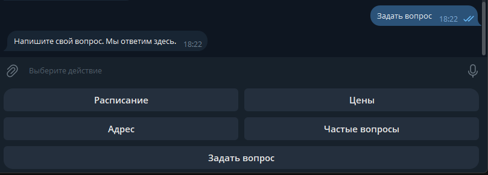
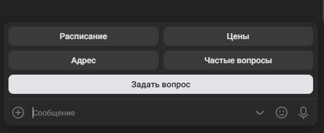

# Dmitry Afonasenko

Frontend developer with 5+ years of commercial experience, focused on Vue and TypeScript.

I take ownership of frontend modules from requirements and estimation through release. My experience includes complex business logic, architecture decisions, testing, and code review.

## Core stack

**TypeScript · Vue · JavaScript · Node.js · Vitest · Playwright**

## Selected work

### [Trajectory](https://github.com/Dmitryaf/trajectory)

A web application for recording everyday life and reviewing weeks and months as a whole. Users record what matters to them and look back at changes over time. The app does not score days or present coincidences as proven causes.

The public repository demonstrates the core flows with synthetic data and no account required. The main application is developed separately.

**[Open the interactive demo](https://dmitryaf.github.io/trajectory/)**

**Vue 3 · TypeScript · Pinia · IndexedDB / Dexie · ECharts · PWA · Vitest · Playwright**

The main application adds authentication and cloud synchronization. Edits are saved on the device and can be made offline; conflicting versions are kept for the user to resolve. It also supports data export, account deletion, and consent controls for optional usage telemetry.

### [Inbox Point](https://github.com/Dmitryaf/inbox-point)

A self-hosted service that brings customer text conversations from Telegram and VK into a Telegram workspace for operators. Configured information sections answer common questions. When a person needs help, an operator replies in a dedicated topic in the operator group, and the response returns to the original messenger. Later requests reuse the customer's topic.

_Emergency web inbox, used when the Telegram operator group is unavailable. See [content management](assets/inbox-point-content.png) and [operations monitoring](assets/inbox-point-operations.png)._

Customer menus in Telegram and VK

**Telegram — starting a question**

**VK — information and contact menu**

**TypeScript · Node.js · Fastify · SQLite · Vue 3 · Vitest · Playwright**

The Vue administration UI manages schedules, prices, FAQs, and custom sections. SQLite keeps delivery state across restarts. Retries are bounded, duplicate events are ignored, and uncertain outcomes require review. Monitoring, backups, and an emergency web inbox support a separate installation for each organization.

### [Agent Engineering Kit](https://github.com/Dmitryaf/agent-engineering-kit)

A toolkit for keeping coding-agent instructions consistent across repositories. Shared engineering rules are selected for each project and task, with updates previewed before applying and project-specific instructions preserved.

**PowerShell · Git · JSON**

The rules have been refined through recurring problems encountered while developing Trajectory and Inbox Point. Evaluation cases help check agent behavior, including staying within scope, preserving local changes, and handling interrupted operations.

## Contact

[Telegram · @dmitry_ako](https://t.me/dmitry_ako)
