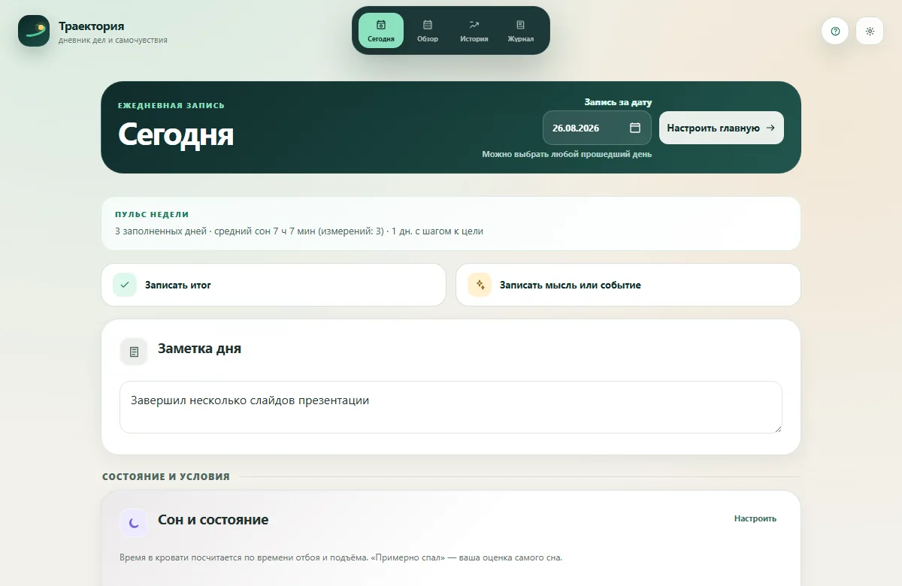
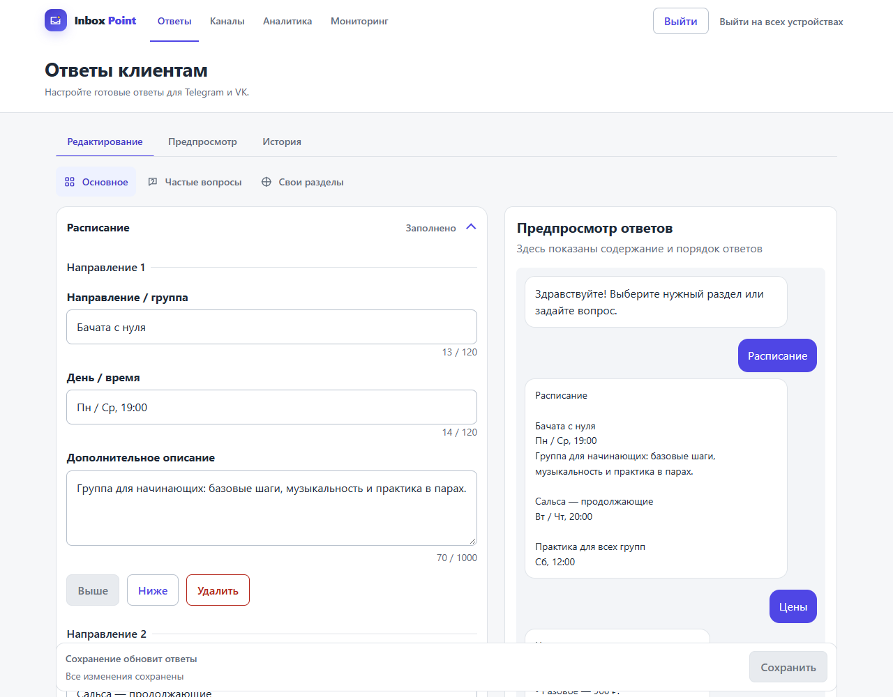

# Dmitry Afonasenko

I'm a frontend developer working mostly with Vue and TypeScript.

I build web applications and tools for managing projects and working with AI coding agents.

## Applications

### Trajectory

A personal journal for daily notes, weekly and monthly reviews, and exploring changes over time. It works offline and syncs records across devices.

[Open the app](https://trajectory-life.ru) · [Source code](https://github.com/Dmitryaf/trajectory-life)

Vue 3 · TypeScript · Pinia · Dexie · Supabase

### Inbox Point

A customer messaging service. Customers write through Telegram or VK, staff reply in Telegram, and answers return to the original conversation. A web interface lets staff manage schedules, prices, and FAQs, and check the service's status.

[Source code](https://github.com/Dmitryaf/inbox-point)

Vue 3 · TypeScript · Node.js · Fastify · SQLite

## Development Tools

### [Control Center](https://github.com/Dmitryaf/control-center)

A local app for managing projects, tasks, ideas, and hypothesis checks in one place.

Vue 3 · TypeScript · Node.js · SQLite

### [Agent Engineering Kit](https://github.com/Dmitryaf/agent-engineering-kit)

A set of rules and tools for working with AI coding agents across repositories. It combines shared engineering rules with project-specific instructions and previews updates before they are applied.

PowerShell · Git

## Contact

[Telegram · @dmitry_tbp](https://t.me/dmitry_tbp)
